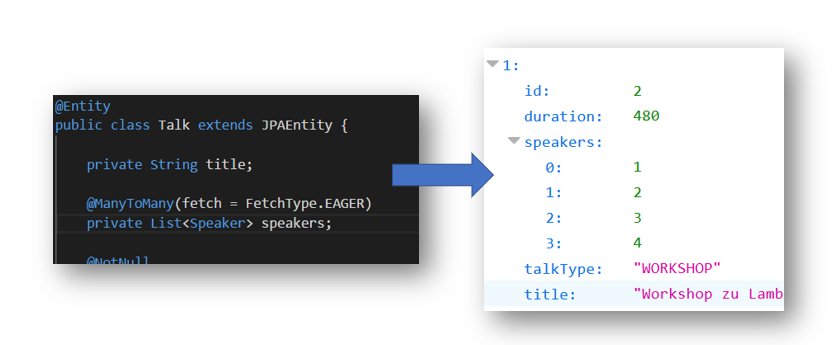

# JPA+Rest, JSONB in Action 

Demo-Projekt zum Blog Beitrag auf:

`https://javaeeblog.wordpress.com/`

> "JSR 367" alias JSON-B soll es endlich richten: ein standartisiertes JSON-Binding, ähnlich der Verarbeitung von XML mit JAXB. Gerade bei der Arbeit mit Rest-Schnittstellen und JPA stolpert man immer wieder über die gleichen Probleme. Wir machen einen ganz kurzen Rundflug über JSON-B und schauen uns eine Möglichkeit die JSON-B Adapters zu verwenden um JPA-Relationen zu mappen.

_by GEDOPLAN, [Dominik Mathmann](https://github.com/dominikmathmann)_
